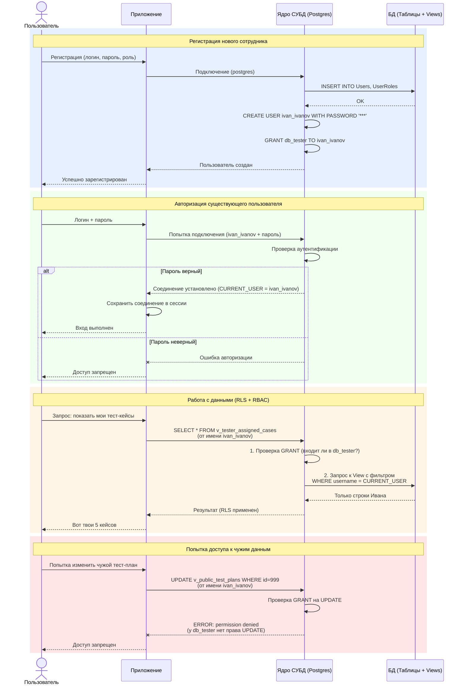

# Secure DB Manager
Проект информационной системы для процесса Автоматизированного тестирования ПО

В проекте делается упор на использование встроенных в СУБД механизмов безопасности, в частности используются роли PostgreSQL для каждого пользователя. Когда пользователь входит в систему, создается новое подключение под его ролью. Жертвуем производительностью в пользу безопасности.

В базе данных есть несколько базовых ролей (контейнеров привилегий на представления) например `db_tester`, от них наследуются роли для каждого конкретного пользователя например `ivan_ivanov`.

## Воркфлоу

Примерная последовательность функционирования приложения:

### Коротко

При создании пользователя нужно:
1. Проверить наличие такого имени пользователя в таблице Users
2. Создать в Users запись с именем и хешем пароля
3. Создать роль в БД на основе базовой роли Guest (менять роль будет администратор БД, только он имеет доступ к нужному представлению и привилегиям)
4. Вернуть результат: Успешно (опционально перейти на домашнюю страницу)

При авторизации:
1. Проверить успешность аутентификации
2. Создать подключение к БД на уровне приложения и сохранить его в памяти совместно с токеном сессии
3. Вернуть успешность результата и перейти на домашнюю страницу

При работе с данными:
1. По JWT токену получить нужно соединение с БД
2. Использовать представления для запросов
3. Во фронт будут возвращаться таблицы произвольной размерности

## Тонкие моменты

- Хранить в поле Users.username имя в таком же формате, как и название роли в БД